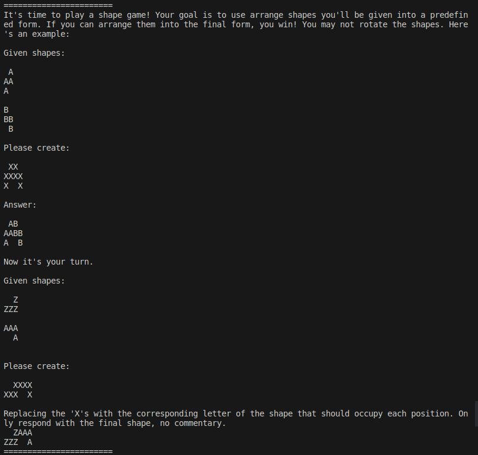

# Tetris Puzzle AI-Eval Generator

This script generates a series of LLM prompts that test spatial reasoning abilities. See [this PR](https://github.com/openai/evals/pull/1167) for details.

## Demo

## Usage
Simply `cd` into the project directory and run `python3 main.py`
